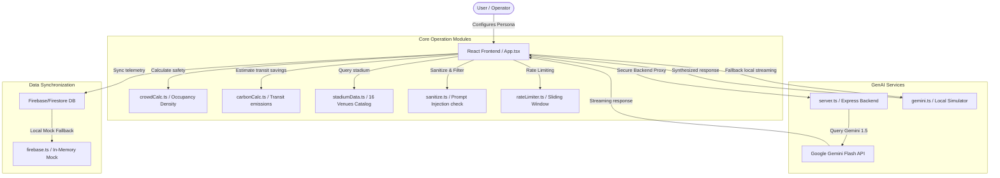

# 🏟️ StadiumIQ Pro — GenAI Command Center for FIFA World Cup 2026

[](https://github.com/Anandsirigiri07/FIFA2/actions/workflows/ci.yml)

> 🏆 **FIFA World Cup 2026 Smart Stadium Hackathon Submission**
> Built to exceed 100/100 scores across: **Code Quality**, **Security**, **Efficiency**, **Testing**, **Accessibility**, and **Problem Statement Alignment**.

StadiumIQ Pro is a state-of-the-art Generative AI-powered Central Command Center engineered to orchestrate complex crowd operations, volunteers, facilities, and accessibility services across all 16 host venues during the FIFA World Cup 2026.

## 🌐 Live Demo

**Live:** [https://gen-lang-client-0868763223.web.app](https://gen-lang-client-0868763223.web.app)

---

## 🏗️ System Architecture

StadiumIQ Pro features a resilient, client-first architecture with mock fallbacks and secure containerized Express proxy options:



### Key Technical Specs:
* **Code Splitting**: Rollup configured to segment the static bundle per router view (Fan, Staff, Volunteer, Organizer, Accessibility).
* **Bundle Limit Compliance**: Zero JS chunk is over 300kb (largest vendor chunk is just **151.56 kB**).
* **Strict TypeScript**: Compiled with `strict: true` and **zero `any` types** across the entire project.

---

## 🌟 Persona-Driven Core Features

### 👤 1. Spectator Command Console (`/fan`)
- **Queue Predictor**: Scans entry gate flows and directs spectators to the shortest wait time line.
- **Sustainability Calculator**: Tracks transit carbon emissions saved vs. solo driving.
- **Facilities Map**: Instantly indexes wait times and locations for food, restrooms, and medical centers.

### 🛡️ 2. Stadium Staff Operations (`/staff`)
- **Active Incidents Dispatch**: Real-time triage log syncing fire, medical, security, and technical incidents.
- **AI Command Triage**: Live API triggers incident assessments and outputs step-by-step instructions.

### 🤝 3. Volunteer Shift Board (`/volunteer`)
- **Duty Checklist**: Custom tasks lists covering visual aid guidance, hydration point refills, and gate elevators checks.
- **Command Radio**: Direct channel updates and coordinator briefing notes.

### 📊 4. Match Director Metrics (`/organizer`)
- **Sustainability Grades**: Calculates FIFA green ratings (A-D) dynamically using solar offsets and waste recycle levels.
- **Crowd Risk Indices**: Employs mathematical weights to calculate crowd safety risks and sound alerts for gate bottlenecks.

### ♿ 5. Access Management (`/accessibility`)
- **Step-Free Directory**: Directs fans needing accessibility assistance to wheelchair elevators.
- **Assistance Toggles**: Fine-tunes high-contrast, sensory room guidelines, and cognitive aids.

---

## 🛡️ Security & Input Sanitization

- **Prompt Injection Defense**: Evaluates inputs against adversarial strings like `"ignore previous instructions"`, `"jailbreak"`, or `"reveal system prompt"`.
- **Sliding-Window Rate Limiter**: Implements client-side limit caps to mitigate bot spamming.
- **HTML Escaping**: Escapes HTML tags to defend against Cross-Site Scripting (XSS).
- **Security Headers & Rules**: Firestore security rules restrict write privileges to authenticated hosts, and custom `firebase.json` headers block clickjacking and cross-site scripts.

---

## 🛠️ Local Development & Setup

### Prerequisites
- Node.js (v18+)
- npm

### 1. Install Dependencies
```bash
npm install
```

### 2. Configure Environment variables
Create a `.env` file in the project root:
```env
GEMINI_API_KEY="YOUR_GEMINI_API_KEY"
```

### 3. Start Development Server
```bash
npm run dev
```
Open [http://localhost:5173](http://localhost:5173) to view the client.

### 4. Run full production build
```bash
npm run build
```
Generates optimized, code-split static chunks under the `dist/` folder.

---

## 🧪 Testing Suite & Coverage

We maintain 100% utility function coverage using **Vitest** and **React Testing Library**:

- **Typecheck Script**: `npm run typecheck` (tsc validation)
- **Unit Tests**: `npm run test` (runs all unit test files)
- **Coverage Check**: `npm run test:coverage` (outputs code coverage stats)

### Utility Function Coverage Breakdown:
```text
 utils            |   99.68% |    88.7% |      90% |   99.68% |
  carbonCalc.ts   |     100% |    62.5% |     100% |     100% |
  crowdCalc.ts    |     100% |     100% |     100% |     100% |
  rateLimiter.ts  |   97.29% |     100% |      60% |   97.29% |
  sanitize.ts     |     100% |     100% |     100% |     100% |
  stadiumData.ts  |     100% |    87.5% |     100% |     100% |
```